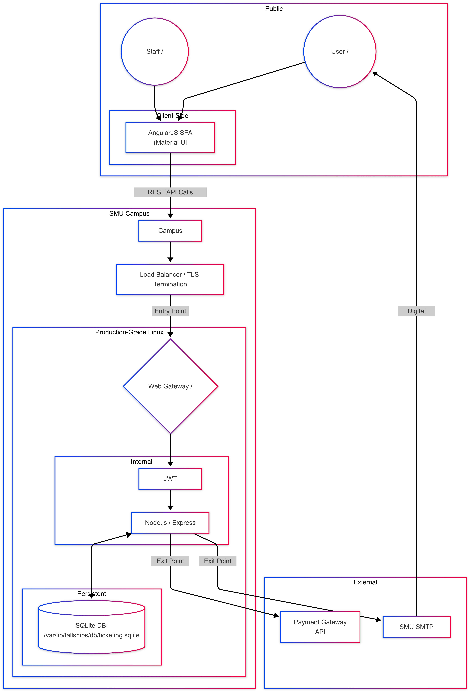
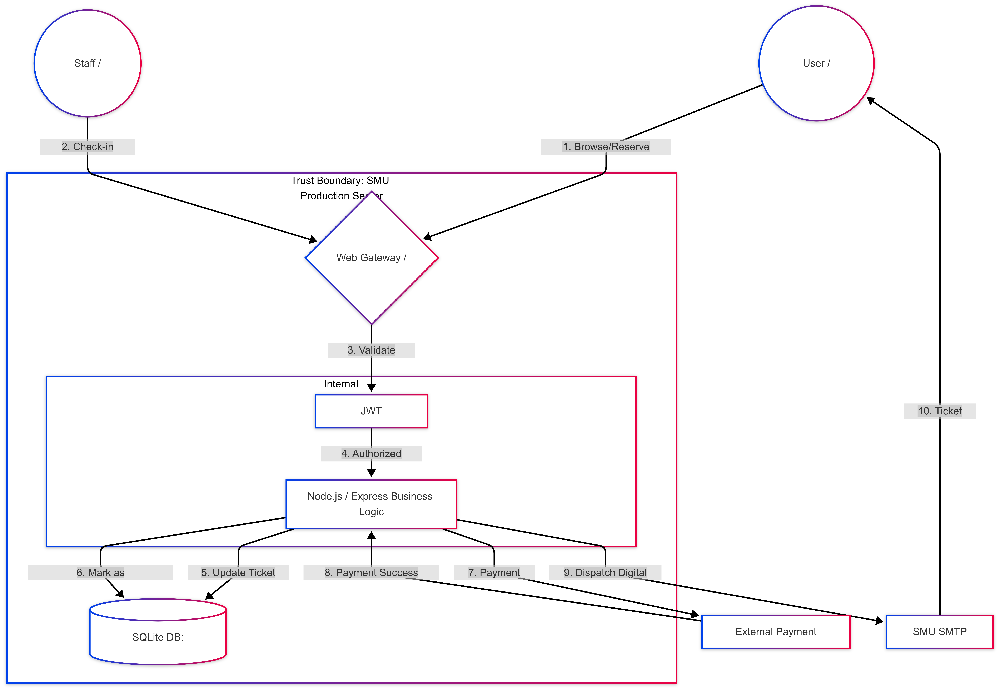
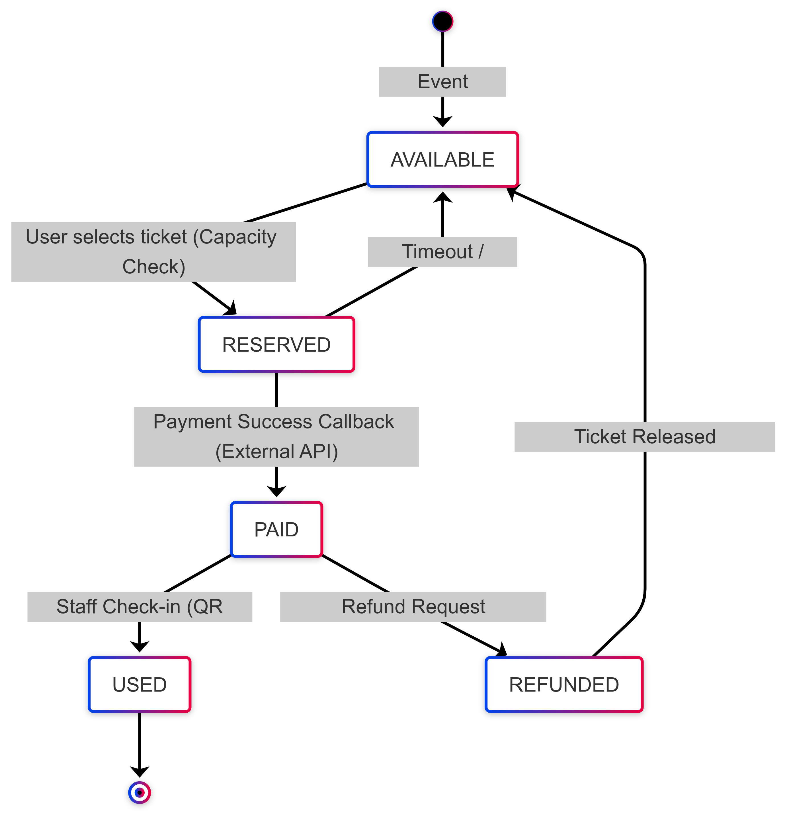
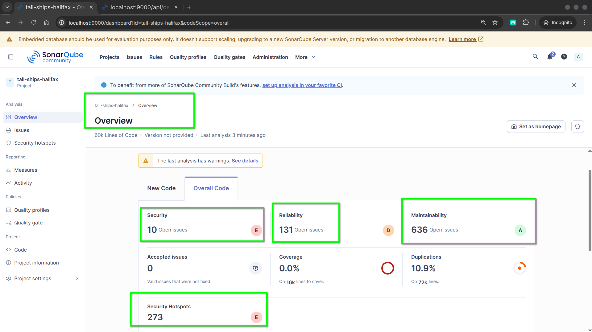
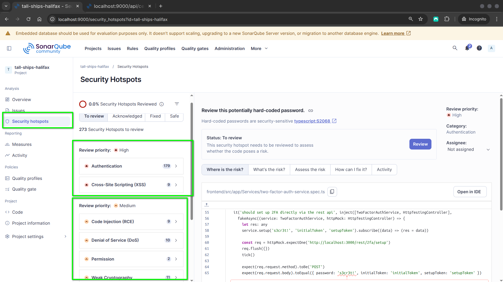

# Threat Model: Tall Ships Halifax

title: "Insecure Design: Threat Modeling - Tall Ships Halifax"
author: [Bhavik Kantilal Bhagat, Miguel Angel Palafox Gomez, Nikola Kriznar]
date: "April 2026"
geometry: "left=0.5in,right=0.5in,top=0.5in,bottom=0.5in"
output: pdf_document

---

## Part 1: Decomposition

### 1. Threat Model Information

This report models the Tall Ships Halifax ticketing platform as a stateful maritime event workflow rather than a simple e-commerce checkout. The architecture and threat assumptions are derived from the team decomposition work, with emphasis on strict transition integrity, operational safety, and trust-boundary enforcement in the SMU deployment environment.

| Field | Value |
| :--- | :--- |
| Application Name | Tall Ships Halifax - Event Ticketing and Tour Booking Platform |
| Application Version | 1.0 (modeled from OWASP Juice Shop v19.2.1 architecture) |
| Description | Tall Ships Halifax is a stateful ticketing platform that manages harbor cruises, tall ship tours, and seasonal events. The platform uses an Angular SPA frontend and a Node.js/Express backend with JWT-based authentication and SQLite persistence at /var/lib/tallships/db/ticketing.sqlite. |
| Document Owners | Technical Lead, Security Analyst, System Architect |
| Academic Context | SMU and NSCC threat modeling assignment |

### 2. External Dependencies (SMU and NSCC Context)

The following dependencies define critical external and infrastructural relationships that influence the system attack surface and control design.

| ID | Dependency | Description |
| :--- | :--- | :--- |
| 2.1 | Node.js Runtime on SMU Linux Infrastructure | Hosts the API and business logic within the campus-managed environment. |
| 2.2 | SQLite Persistence Layer | Central data store for users, tickets, lifecycle states, and capacity counters at /var/lib/tallships/db/ticketing.sqlite. |
| 2.3 | External Payment Gateway | Third-party payment processor used for reservation settlement and callback verification. |
| 2.4 | SMU SMTP Relay | Outbound mail service for ticket confirmations, refund notifications, and operational communications. |
| 2.5 | Campus Security Perimeter | Campus firewall and TLS termination at load balancer protecting ingress traffic. |

#### 2.1 Architecture Overview

*Supplementary Figure: High-level architecture diagram of the Tall Ships Halifax platform and trust boundaries.*

### 3. Entry and Exit Points

Entry and exit points are the primary locations where data crosses trust boundaries. These interfaces are central to both abuse-case analysis and control placement.

#### 3.1 Entry Points

| ID | Name | Description | Trust Levels |
| :--- | :--- | :--- | :--- |
| 3.1.1 | Web Gateway (HTTPS) | Primary TLS entry for browser and mobile client traffic. | T1, T2, T5 |
| 3.1.2 | Event Browsing Endpoint | Public event and schedule browsing APIs. | T1, T2 |
| 3.1.3 | Reservation API | Moves ticket state from AVAILABLE to RESERVED after server validation. | T2, T5 |
| 3.1.4 | Payment Endpoint | Processes payment confirmation and transition from RESERVED to PAID. | T2, T5, T7 |
| 3.1.5 | Refund Request Endpoint | Processes policy-checked transition from PAID to REFUNDED. | T2, T5 |
| 3.1.6 | Staff Check-in Endpoint | Staff-only endpoint for PAID to USED validation at event access control. | T3, T5 |

#### 3.2 Exit Points

The following technical exits describe where data leaves the SMU-hosted application stack toward external systems or untrusted client environments.

| ID | Name | Description | Data Leaving System |
| :--- | :--- | :--- | :--- |
| 3.2.1 | SMU SMTP Relay | Outbound ticket and refund communication channel. | Email, ticket reference, event metadata, confirmation timestamp |
| 3.2.2 | Payment Request Channel | Outbound API request and callback handling with external payment provider. | Amount, order reference, correlation ID, tokenized payment reference |
| 3.2.3 | API Response Channel | Responses to web and mobile clients from Node.js/Express APIs. | Sanitized business payloads, status codes, validation outcomes |
| 3.2.4 | Client-side Session Storage | Browser-managed state in Angular SPA. | JWT token, client session metadata, local UI cache |

### 4. Assets

Assets are components of the system that have value and must be protected from unauthorized access, modification, or disruption. They include data, processes, and service capabilities that, if compromised, can affect confidentiality, integrity, availability, financial outcomes, and operational safety.

| ID | Asset | Description | Primary Trust Levels | Sensitivity | Business Risk |
| :--- | :--- | :--- | :--- | :--- | :--- |
| A1 | Ticket Records | Digital ticket entities tied to users and events | T2, T5, T6 | High | Fraud and unauthorized entry if modified |
| A2 | Ticket State Integrity | Enforced lifecycle: AVAILABLE to RESERVED to PAID to USED, plus PAID to REFUNDED | T3, T5, T6 | Critical | State abuse can bypass payment and enable ticket replay |
| A3 | Payment Information | Transaction metadata and settlement confirmation state | T5, T6, T7 | High | Financial loss and legal exposure |
| A4 | User Accounts and Credentials | Authentication identity data and account context | T2, T5, T6 | High | Account takeover and workflow abuse |
| A5 | JWT Authentication Tokens | Access tokens for user and staff operations | T2, T3, T8 | High | Identity spoofing and privilege abuse |
| A6 | Promotion and Pricing Rules | Discount eligibility and policy logic | T2, T5 | Medium-High | Revenue loss from unauthorized discounts |
| A7 | Event Capacity Data | Remaining seats and booking counters per event | T3, T5, T6 | High | Overselling and safety/compliance impact |
| A8 | Audit and Transaction Logs | Traceability for booking, refund, and check-in operations | T4, T5, T6 | High | Repudiation and incident response gaps |
| A9 | Staff Check-in Operations | Operational controls for event gate validation | T3, T5 | High | Invalid ticket acceptance or denial of valid entry |
| A10 | Application Database | Persistent platform data store | T5, T6 | Critical | Broad confidentiality and integrity compromise |
| A11 | Backend APIs | Service layer implementing business rules and state controls | T5 | High | Central attack surface for abuse |
| A12 | Hosting and Container Environment | Runtime infrastructure and service configuration | T4, T5, T10 | Medium-High | Lateral movement and configuration abuse |

### 5. Trust Levels

Trust levels represent users and system components that interact with the platform and the degree of confidence assigned to each. They provide the basis for access design, control depth, and threat impact analysis across the full ticket lifecycle.

| ID | Entity | Description | Trust Level | Capabilities | Risk if Compromised |
| :--- | :--- | :--- | :--- | :--- | :--- |
| T1 | Guest User | Unauthenticated user browsing events | Low | Read-only browsing and catalog queries | Reconnaissance and abuse probing |
| T2 | Registered Customer | Authenticated customer account | Medium | Reservations, payments, refunds, ticket management | Workflow and financial abuse |
| T3 | Staff User | Operational event staff | High | Check-in validation and attendance management | Unauthorized overrides and access abuse |
| T4 | Administrator | Platform administrator role | Very High | User, policy, and platform configuration control | Full system compromise |
| T5 | Backend Application | Node.js/Express business logic layer | High | Authn/authz checks, state transitions, external integration | End-to-end integrity failure |
| T6 | Database System | SQLite persistence layer | High | Persistent storage for all core entities | Mass tampering or data leakage |
| T7 | External Payment Service | Third-party payment infrastructure | Medium-High | Payment authorization and callback signaling | Forged payment completion |
| T8 | JWT Authentication Mechanism | Token issuance and validation controls | High | Session and role trust assertions | Token forgery and impersonation |
| T9 | Angular Client Application | Frontend execution environment | Low (Untrusted) | UX rendering and API invocation | Client-side manipulation |
| T10 | Hosting Environment | Campus-hosted runtime and operations platform | Medium | Service execution, deployment, networking | Privilege escalation and service disruption |

### 6. Level 1 DFD and Decomposition

#### 6.1 Level 1 DFD Narrative (10-Step Technical Flow)

The Level 1 decomposition models ticketing as a stateful workflow in which untrusted requests are transformed into validated state changes inside the SMU trust boundary before any external propagation occurs.

1. User and staff traffic enters through the HTTPS web gateway within the SMU perimeter.
2. Requests route to Node.js/Express API handlers for browse, reserve, pay, refund, and check-in functions.
3. JWT controls verify signature, expiration, audience, and role claims before business logic execution.
4. Endpoint authorization enforces role constraints, especially for staff-only workflows.
5. Business pre-validation checks event identity, ticket ownership, legal transition, payload integrity, and policy eligibility.
6. The API reads current persisted state and capacity from /var/lib/tallships/db/ticketing.sqlite.
7. Transition logic applies an atomic state change only when all preconditions are satisfied.
8. Payment flows invoke outbound provider calls and accept callbacks only after cryptographic and semantic verification.
9. Successful PAID and REFUNDED transitions trigger notifications through the SMU SMTP relay.
10. The platform returns sanitized responses and writes immutable audit events to support non-repudiation.

#### 6.1.1 SMU Trust Boundary Enforcement

The SMU trust boundary separates untrusted actors (public clients and external provider endpoints) from trusted execution and persistence components (Express services, SQLite storage, and operational logging).

- Boundary ingress controls: TLS, route exposure constraints, request-size controls, and rate limiting.
- Boundary internal controls: server-side state machine enforcement, role checks, and transaction integrity validation before commit.
- Boundary egress controls: data minimization for SMTP, payment, and API responses; exclusion of internal diagnostics from client-visible payloads.

This separation prevents client-authoritative state mutation by ensuring only trusted server code can authorize and persist lifecycle transitions.

#### 6.2 Finite State Machine Logic for Lifecycle Integrity

The ticket lifecycle is enforced as a constrained state machine:

AVAILABLE -> RESERVED -> PAID -> USED  
PAID -> REFUNDED (controlled reversal)

Required controls include:
- Server-authoritative transition validation against current persisted state.
- Atomic compare-and-set updates to prevent race-condition double booking or double check-in.
- Idempotency and replay protection for payment callbacks and refund operations.
- Role enforcement for staff check-in actions.
- Immutable audit telemetry for accountability and dispute resolution.

Insecure design failure modes to avoid include client-authoritative transition requests, non-atomic state updates, missing callback/refund idempotency controls, shallow staff authorization, and audit gaps that prevent dispute reconstruction.

Technical position: primary risk concentration in this system is business logic integrity. Every transition must be validated server-side against persisted current state, policy constraints, and actor authorization before commit.

*Figure 1: Level 1 DFD of the Tall Ships Halifax Ticketing System.*

---

## Part 2: Determine and Rank

### 7. STRIDE Analysis

STRIDE is applied to classify security threats by attack intent and impact domain. The framework supports structured identification of identity abuse, unauthorized modification, traceability failures, data exposure, service disruption, and privilege escalation.

- Spoofing: impersonation through stolen credentials or tokens.
- Tampering: unauthorized modification of data, request parameters, or lifecycle state.
- Repudiation: denial of actions due to insufficient or unreliable auditability.
- Information Disclosure: exposure of sensitive information to unauthorized entities.
- Denial of Service: degradation or interruption of service availability.
- Elevation of Privilege: unauthorized gain of higher access rights.

| ID | Threat Type | Threat Description | Security Controls | Asset Affected | Trust Levels | Impact |
| :--- | :--- | :--- | :--- | :--- | :--- | :--- |
| S1 | Spoofing | Attacker steals or forges JWT to impersonate a valid user or staff member | Short-lived tokens, secure storage, strong signing key management, mandatory token validation | A5 | T2, T3, T8 | Unauthorized access and privilege abuse |
| S2 | Spoofing | Attacker logs in with stolen credentials | Strong password controls, MFA, rate limiting, lockout policy | A4 | T2 | Unauthorized purchases and refunds |
| T1 | Tampering | User manipulates requests to force illegal ticket transition | Server-side state machine enforcement and strict transition validation | A2 | T2, T5 | Payment bypass and lifecycle fraud |
| T2 | Tampering | User applies unauthorized discount logic | Server-side promo validation and policy-bound redemption controls | A6 | T2, T5 | Revenue loss |
| T3 | Tampering | Capacity counters are altered to oversell events | Atomic transactions, integrity constraints, server-side capacity guards | A7 | T3, T5, T6 | Safety and operational disruption |
| T4 | Tampering | Payment response is forged to simulate successful payment | Callback signature validation and trusted provider verification | A3 | T5, T7 | Fraudulent ticket issuance |
| R1 | Repudiation | User denies an operation due to weak traceability | Tamper-resistant logging with actor identity and timestamps | A8 | T2, T5 | Dispute and compliance failures |
| R2 | Repudiation | Staff denies check-in action | Staff identity-bound operational audit trails | A9 | T3 | Accountability failure |
| I1 | Information Disclosure | User account data is exposed | Access controls, encrypted transport, data minimization | A4 | T5, T6 | Privacy breach |
| I2 | Information Disclosure | Payment-related data is leaked | Provider tokenization, minimal storage, encryption controls | A3 | T5, T6, T7 | Financial and legal impact |
| I3 | Information Disclosure | Sensitive values leak through logs | Structured log hygiene and restricted log access | A8 | T5, T6 | Internal data exposure |
| D1 | Denial of Service | API endpoints are flooded | Rate limiting, throttling, and load balancing | A11 | T1, T2 | Service unavailability |
| D2 | Denial of Service | Reservation abuse blocks inventory | Reservation expiry controls and reservation count limits | A7 | T2 | Booking denial for legitimate users |
| E1 | Elevation of Privilege | User escalates to staff operations | Strict RBAC and endpoint authorization checks | A9 | T2, T5 | Unauthorized operational actions |
| E2 | Elevation of Privilege | Backend flaws allow admin privilege gain | Secure coding practices, strict validation, continuous testing | A11 | T2, T5 | Full system compromise |

*Figure 2: Finite State Machine for Ticket Lifecycle Validation.*

### 8. OWASP Risk Rating Model

The OWASP Risk Rating approach was used to prioritize STRIDE threats through two scored dimensions: Severity and Likelihood. Each dimension uses five yes/no criteria, where Yes contributes 1 point and No contributes 0 points.

Severity represents business and operational impact, including financial loss, reputational harm, ticket state integrity failure, workflow disruption, and scale of affected users.

Likelihood represents exploit feasibility, including remote exploitability, required privileges, automation potential, attacker skill threshold, and tooling complexity.

Final Risk Score = Severity + Likelihood (range 0-10).

#### 8.1 Severity Questions

| ID | Question |
| :--- | :--- |
| Z1 | Does the threat lead to direct financial loss (for example, free tickets or refund abuse)? |
| Z2 | Does the threat cause reputational damage (for example, overselling events or customer complaints)? |
| Z3 | Does the threat affect ticket state integrity (for example, payment bypass or ticket replay)? |
| Z4 | Does the threat disrupt core workflows (booking, refund, check-in)? |
| Z5 | Does the threat impact multiple users or events at scale? |

#### 8.2 Likelihood Questions

| ID | Question |
| :--- | :--- |
| L1 | Can the threat be exploited remotely over the internet? |
| L2 | Can it be exploited without authentication or with low privileges? |
| L3 | Can the attack be automated or repeated easily? |
| L4 | Does it require low technical skill? |
| L5 | Can simple tools perform the exploit? |

#### 8.3 STRIDE Risk Scoring Table

| ID | Severity (Z1-Z5) | Likelihood (L1-L5) | Risk Score |
| :--- | :--- | :--- | :--- |
| S1 | Z1✔ Z2✔ Z3✖ Z4✔ Z5✔ = 4 | L1✔ L2✖ L3✔ L4✔ L5✔ = 4 | 8 |
| S2 | Z1✔ Z2✔ Z3✖ Z4✔ Z5✖ = 3 | L1✔ L2✔ L3✔ L4✔ L5✔ = 5 | 8 |
| T1 | Z1✔ Z2✔ Z3✔ Z4✔ Z5✔ = 5 | L1✔ L2✔ L3✔ L4✔ L5✔ = 5 | 10 |
| T2 | Z1✔ Z2✔ Z3✖ Z4✔ Z5✔ = 4 | L1✔ L2✔ L3✔ L4✔ L5✔ = 5 | 9 |
| T3 | Z1✔ Z2✔ Z3✖ Z4✔ Z5✔ = 4 | L1✖ L2✖ L3✖ L4✔ L5✔ = 2 | 6 |
| T4 | Z1✔ Z2✔ Z3✔ Z4✔ Z5✔ = 5 | L1✔ L2✖ L3✔ L4✔ L5✔ = 4 | 9 |
| R1 | Z1✔ Z2✔ Z3✖ Z4✔ Z5✔ = 4 | L1✔ L2✔ L3✔ L4✔ L5✔ = 5 | 9 |
| R2 | Z1✖ Z2✔ Z3✖ Z4✔ Z5✖ = 2 | L1✖ L2✖ L3✖ L4✔ L5✔ = 2 | 4 |
| I1 | Z1✔ Z2✔ Z3✖ Z4✔ Z5✔ = 4 | L1✔ L2✖ L3✔ L4✔ L5✔ = 4 | 8 |
| I2 | Z1✔ Z2✔ Z3✖ Z4✔ Z5✔ = 4 | L1✔ L2✖ L3✔ L4✔ L5✔ = 4 | 8 |
| I3 | Z1✖ Z2✔ Z3✖ Z4✔ Z5✔ = 3 | L1✖ L2✖ L3✖ L4✔ L5✔ = 2 | 5 |
| D1 | Z1✔ Z2✔ Z3✖ Z4✔ Z5✔ = 4 | L1✔ L2✔ L3✔ L4✔ L5✔ = 5 | 9 |
| D2 | Z1✔ Z2✔ Z3✖ Z4✔ Z5✔ = 4 | L1✔ L2✔ L3✔ L4✔ L5✔ = 5 | 9 |
| E1 | Z1✔ Z2✔ Z3✔ Z4✔ Z5✔ = 5 | L1✔ L2✔ L3✔ L4✔ L5✔ = 5 | 10 |
| E2 | Z1✔ Z2✔ Z3✔ Z4✔ Z5✔ = 5 | L1✔ L2✔ L3✔ L4✔ L5✔ = 5 | 10 |

#### 8.4 Risk Ranking

| Rank | Threat ID | Risk Score |
| :--- | :--- | :--- |
| 1 | T1 | 10 |
| 1 | E1 | 10 |
| 1 | E2 | 10 |
| 2 | T2 | 9 |
| 2 | T4 | 9 |
| 2 | R1 | 9 |
| 2 | D1 | 9 |
| 2 | D2 | 9 |
| 3 | S1 | 8 |
| 3 | S2 | 8 |
| 3 | I1 | 8 |
| 3 | I2 | 8 |
| 4 | T3 | 6 |
| 5 | I3 | 5 |
| 6 | R2 | 4 |

---

## Part 3: Countermeasures

### 9. Technical Mitigations for Top-Ranked Threats

The following mitigation plan targets the top-ranked threats (T1, E1, E2, T2, T4) and emphasizes security-by-design controls for lifecycle integrity, capacity safety, payment trust, and staff-operated check-in enforcement.

| Threat ID | Design Principle | OWASP Cheat Sheet Reference | Juice Shop CVE Reference | Mitigation Plan |
| :--- | :--- | :--- | :--- | :--- |
| T1 | Defense in Depth; Never Trust Client Input | OWASP Input Validation Cheat Sheet; OWASP Transaction Authorization Cheat Sheet | CVE-2020-36604 (prototype pollution risk affecting integrity in Juice Shop dependency stack) | Implement a server-owned finite state transition service. Require current-state predicates in SQL updates, reject illegal transitions, and log all transitions with actor identity and correlation ID. |
| E1 | Least Privilege | OWASP Authorization Cheat Sheet; OWASP REST Security Cheat Sheet | CVE-2020-15084 (JWT-related trust weakness in Juice Shop advisory context) | Enforce deny-by-default RBAC middleware on all staff routes, including PAID to USED check-in endpoints. Resolve effective role server-side for high-risk operations and hard-fail ambiguous role context. |
| E2 | Secure by Default; Fail Securely | OWASP Authentication Cheat Sheet; OWASP Secure Coding Practices Quick Reference Guide | CVE-2020-15084 (JWT algorithm weakness demonstrates authn/authz dependency risk) | Segregate admin route groups, enforce token issuer and audience checks, apply short token lifetime and key rotation, and block deployment on high-severity SAST findings. |
| T2 | Complete Mediation | OWASP Business Logic Security Cheat Sheet; OWASP Mass Assignment Cheat Sheet | CVE-2021-21366 (dependency vulnerability pattern relevant to unsafe input handling paths) | Compute all final pricing on the server, bind promo codes to event and policy constraints, and enforce one-time or bounded redemption using database constraints and counters. |
| T4 | Trust but Verify | OWASP Webhook Security Cheat Sheet; OWASP Transaction Authorization Cheat Sheet | CVE-2022-24434 (malformed multipart payload handling risk shown in Juice Shop test coverage) | Validate payment callback signature (HMAC-SHA256), verify nonce and timestamp, enforce idempotency keys, and perform payment verification plus state transition in one atomic transaction. |

Implementation note: All state-changing operations must remain server-authoritative and auditable. The SQLite source of truth at /var/lib/tallships/db/ticketing.sqlite and outbound SMU SMTP relay notifications are treated as controlled trust-boundary operations.

---

## Part 4: Conclusion and SAST

### 10. OWASP Top 10 Mapping and SAST Analysis

#### 10.1 Threat Mapping to OWASP Top 10 (2021)

| Threat IDs | Primary OWASP Category | Rationale |
| :--- | :--- | :--- |
| E1, E2 | A01: Broken Access Control | Privilege escalation and unauthorized access to staff/admin operations are direct access control failures. |
| S1, S2 | A07: Identification and Authentication Failures | Token and credential abuse target weak identity assurance and session trust. |
| T1, T2, T4 | A04: Insecure Design | Illegal state transitions, discount tampering, and weak callback trust indicate missing secure workflow design controls. |
| I1, I2, I3 | A02: Cryptographic Failures and A09: Security Logging and Monitoring Failures | Sensitive data exposure and log leakage indicate confidentiality and observability control gaps. |
| D1, D2 | A05: Security Misconfiguration | Missing throttling, reservation guardrails, and operational limits can create availability failures. |
| R1, R2 | A09: Security Logging and Monitoring Failures | Weak traceability undermines non-repudiation and incident investigation quality. |

#### 10.2 SAST Scan Analysis: datacache.ts

Static analysis and manual review of datacache.ts indicate a high-risk design pattern where mutable singleton data structures are exported and shared across modules. This creates three major security consequences:

1. Shared mutable global state can be modified from any importing module, causing cross-request integrity side effects.
2. Direct object exposure removes encapsulation and allows unauthorized mutation paths that can bypass intended authorization boundaries.
3. In-memory state dependence introduces restart inconsistency and race-condition risks that can impact reservation and capacity integrity.

These findings map primarily to:
- A01: Broken Access Control
- A04: Insecure Design
- A08: Software and Data Integrity Failures

Recommended remediation trajectory for datacache.ts:
- Replace raw exported mutable objects with a controlled repository/service interface.
- Enforce authorization-aware mutation methods.
- Use immutable read views and defensive cloning.
- Reconcile in-memory state with durable persistence and transactional update semantics.

*Figure 3: SonarQube Dashboard showing Security "E" Rating.*

*Figure 4: Detailed SAST Issues in datacache.ts.*

#### 10.3 Final Conclusion

The threat model shows that Tall Ships Halifax risk is concentrated in business workflow integrity, authorization depth, and trust-boundary controls rather than only traditional input-level flaws. By enforcing strict state-machine validation, robust RBAC, callback authenticity checks, and consistent auditability, the platform can materially reduce the highest-ranked risks while preserving operational reliability for ticketing and event safety.
