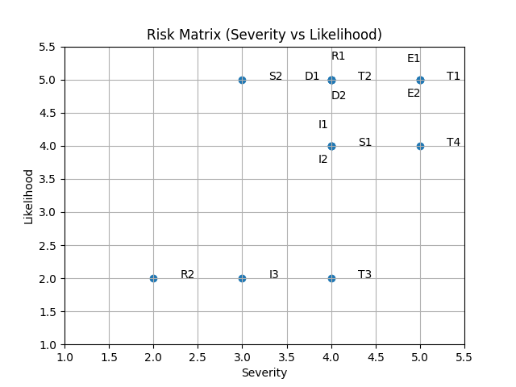

## Section 4: Assets

Assets are components of the system that have value and must be protected from unauthorized access, modification, or disruption.
They include data, processes, and system functionalities that, if compromised, could impact security, financial integrity, or system operation.
In general, assets represent anything of value to the system that could be targeted or abused by an attacker.

| ID | Asset | Description | Associated Trust Level | Sensitivity | Why It Matters (Risk) |
| :--- | :--- | :--- | :--- | :--- | :--- |
| A1 | Ticket Records | Digital tickets associated with users and events | Registered User, Backend, Database | High | Unauthorized modification or duplication could allow fraud (free entry, resale abuse) |
| A2 | Ticket State Integrity (Available, Reserved, Paid, Used) | Lifecycle state machine for tickets: AVAILABLE → RESERVED → PAID → USED (plus REFUNDED for reversals). | Backend, Database, Staff | Critical | Manipulation of states can bypass payment, enable reuse of tickets, or trigger fraudulent refunds |
| A3 | Payment Information | Transaction data related to ticket purchases | Backend, Database, External Payment System | High | Exposure or manipulation can lead to financial loss and legal consequences |
| A4 | User Accounts & Credentials | Login data and user identity information | Registered User, Backend, Database | High | Compromise enables unauthorized purchases, refunds, or ticket transfers |
| A5 | JWT Authentication Tokens | Tokens used to authenticate users and staff | Registered User, Staff, Backend | High | If stolen or forged, attackers can impersonate users or escalate privileges |
| A6 | Promotional Codes & Pricing Rules | Discount logic and promotional mechanisms | Registered User, Backend | Medium-High | Abuse can result in unauthorized discounts and revenue loss |
| A7 | Event Capacity Data | Number of available spots per event | Backend, Database, Staff | High | Tampering can lead to overselling, safety issues, and reputational damage |
| A8 | Transaction & Audit Logs | Records of purchases, refunds, and check-ins | Backend, Database, Admin | High | Needed for dispute resolution; lack of integrity enables repudiation attacks |
| A9 | Staff Operations (Check-in System) | Tools used by staff to validate tickets and manage entry | Staff, Backend | High | Compromise can allow invalid tickets to be accepted or valid ones rejected |
| A10 | Database (Relational Storage) | Stores all persistent system data | Database, Backend | Critical | Central point of failure; breach affects all assets |
| A11 | Application Backend (APIs) | Node.js + Express APIs handling business logic | Backend | High | Vulnerabilities here can expose or manipulate all core operations |
| A12 | Containerized Infrastructure | Deployment environment hosting services | Admin, Backend | Medium-High | Misconfiguration can expose services or enable lateral movement |

---

## Section 5: Trust Levels

Trust Levels represent the entities that interact with the system and the degree of trust assigned to them based on their role and behavior.
They include both human users and system components, each with different capabilities and access to system resources.
Trust levels define the degree of trust and the level of access the application grants to these entities.

| ID | Entity | Description | Trust Level | Capabilities | Risk if Compromised |
| :--- | :--- | :--- | :--- | :--- | :--- |
| T1 | Guest User (Unauthenticated) | User browsing events without logging in | Low | View events, pricing, availability | Can probe entry points and attempt attacks |
| T2 | Registered User (Customer) | Authenticated user purchasing and managing tickets | Medium | Purchase tickets, apply discounts, transfer tickets, request refunds | Can abuse workflows (refund abuse, ticket misuse) |
| T3 | Staff User | Employees managing check-in and capacity | High | Validate tickets, control event entry, manage attendance | Can override controls or allow unauthorized access |
| T4 | Administrator | System-level user with full access | Very High | Manage users, pricing rules, events, system configuration | Full system compromise if exploited |
| T5 | Backend Application (API Server) | Core logic processing requests and enforcing rules | High | Handles authentication, ticket lifecycle, pricing, validation | Business logic bypass if compromised |
| T6 | Database System | Stores all persistent data | High | Stores tickets, users, transactions, states | Data tampering or leakage affects entire system |
| T7 | External Payment System | Third-party service handling payments | Medium-High | Processes transactions and returns payment status | Fake payment confirmations or fraud |
| T8 | Authentication Mechanism (JWT) | Token-based authentication system | High | Grants access based on token validity | Token forgery or impersonation |
| T9 | Client Application (Angular SPA) | Frontend interface used by users and staff | Low (Untrusted) | Sends requests to backend APIs | Can be manipulated; cannot be trusted |
| T10 | Container/Hosting Environment | Infrastructure running the application | Medium | Hosts services and manages deployment | Misconfiguration or privilege escalation |

---

### Section 7: STRIDE Analysis

STRIDE is a threat modeling framework used to identify and categorize potential security threats in a system based on different types of risks.
It helps analyze how an application can be attacked by examining vulnerabilities.

S – Spoofing: Impersonating another user or system (e.g., using stolen credentials or tokens) to gain unauthorized access.

T – Tampering: Modifying data or system state (e.g., altering requests or changing ticket states) in an unauthorized way.

R – Repudiation: Denying actions performed in the system due to lack of proper logging or tracking (e.g., a user denies making a purchase).

I – Information Disclosure: Exposing sensitive information to unauthorized parties (e.g., leaking user data or payment details).

D – Denial of Service (DoS): Disrupting system availability so legitimate users cannot access services (e.g., flooding APIs or blocking ticket availability).

E – Elevation of Privilege: Gaining higher access rights than intended (e.g., a user becomes an admin or staff member).

| ID | Threat Type | Threat Description | Security Controls | Asset Affected | Trust Levels | Impact |
| :--- | :--- | :--- | :--- | :--- | :--- | :--- |
| S1 | Spoofing | Attacker steals or forges JWT to impersonate a valid user or staff member | Use short-lived tokens, secure storage (HttpOnly cookies), token signing with strong secrets, token validation on every request | A5 – JWT Tokens | T2, T3, T8 | Unauthorized access, privilege escalation |
| S2 | Spoofing | Attacker uses stolen credentials to log in as another user | Enforce strong passwords, multi-factor authentication (MFA), rate limiting, account lockout mechanisms | A4 – User Accounts | T2 | Unauthorized actions (purchases, refunds) |
| T1 | Tampering | User manipulates requests to change ticket state without proper workflow | Enforce server-side validation of state transitions, implement state machine logic, never trust client input | A2 – Ticket State Integrity | T2, T5 | Payment bypass, fraud |
| T2 | Tampering | User alters request to apply unauthorized discounts | Validate promo codes server-side, enforce usage limits, bind codes to specific users/events | A6 – Promo Codes | T2, T5 | Revenue loss |
| T3 | Tampering | Attacker modifies capacity to oversell tickets | Enforce database constraints, atomic transactions, server-side validation of capacity limits | A7 – Event Capacity Data | T3, T5, T6 | Safety risk, inconsistency |
| T4 | Tampering | Manipulation of payment response to simulate success | Verify payments via trusted payment gateway callbacks/webhooks, never trust client-side payment status | A3 – Payment Information | T5, T7 | Fraudulent ticket acquisition |
| R1 | Repudiation | User denies performing actions due to insufficient logging | Implement secure, tamper-resistant logging, include timestamps and user IDs | A8 – Audit Logs | T2, T5 | Disputes unresolved |
| R2 | Repudiation | Staff denies ticket validation actions | Log all staff actions with identity tracking, enforce audit trails | A9 – Check-in System | T3 | Lack of accountability |
| I1 | Information Disclosure | Exposure of user data | Encrypt sensitive data, enforce access controls, use HTTPS | A4 – User Accounts | T5, T6 | Privacy breach |
| I2 | Information Disclosure | Leakage of payment data | Use PCI-compliant payment providers, encrypt data, avoid storing sensitive payment info | A3 – Payment Info | T5, T6, T7 | Financial/legal risk |
| I3 | Information Disclosure | Sensitive data exposed in logs | Sanitize logs, avoid storing sensitive data, restrict log access | A8 – Logs | T5, T6 | Internal data leakage |
| D1 | Denial of Service | Flooding API endpoints | Implement rate limiting, API throttling, load balancing | A11 – Backend APIs | T1, T2 | Service disruption |
| D2 | Denial of Service | Abuse of reservation system to block tickets | Use reservation timeouts, limit number of active reservations per user | A7 – Capacity System | T2 | Prevents legitimate bookings |
| E1 | Elevation of Privilege | User escalates privileges to perform staff actions | Enforce role-based access control (RBAC), validate permissions server-side | A9 – Staff Operations | T2, T5 | Unauthorized operations |
| E2 | Elevation of Privilege | Exploiting backend to gain admin access | Input validation, secure coding practices, regular security testing (SAST/DAST) | A11 – Backend APIs | T2, T5 | Full system compromise |

## Section 8: OWASP Risk Rating Model

The following method was applied to evaluate and prioritize the identified STRIDE threats. Each threat was assessed using two dimensions: Severity and Likelihood, both scored on a scale from 0 to 5 using a set of predefined yes/no questions. Each question was evaluated using a binary approach, where a “Yes” response contributes 1 point and a “No” response contributes 0 points.

Severity measures the potential impact of a threat and was determined based on financial loss, reputational damage, impact on ticket state integrity, disruption of core business workflows, and the scale of affected users.

Likelihood measures how feasible the attack is and was evaluated based on factors such as remote exploitability, required authentication level, potential for automation, and the level of technical skill and tools required.

The final Risk Score was calculated as the sum of Severity and Likelihood (range 0–10). This approach provides a transparent and consistent method to rank threats, with particular emphasis on business workflow abuse and financial impact.

---

### Severity Questions

| ID | Question |
| :--- | :--- |
| Z1 | Does the threat lead to direct financial loss? (e.g., free tickets, refund abuse, pricing manipulation) |
| Z2 | Does the threat cause reputational damage to the organization? (e.g., overselling events, public complaints) |
| Z3 | Does the threat affect ticket state integrity? (e.g., bypassing payment, reusing tickets) |
| Z4 | Does the threat affect core business workflows? (e.g., booking, refunds, check-in processes) |
| Z5 | Does the threat impact multiple users or the system at scale? (e.g., many tickets/events affected) |

---

### Likelihood Questions

| ID | Question |
| :--- | :--- |
| L1 | Can the threat be exploited remotely (over the internet)? |
| L2 | Can the threat be exploited without authentication or with low privileges? |
| L3 | Can the attack be automated or repeated easily? |
| L4 | Does the exploit require low technical skill? (e.g., simple request manipulation) |
| L5 | Does the exploit require only simple tools? (e.g., browser dev tools, scripts) |

---

### STRIDE Risk Scoring

| ID | Severity (Z1–Z5) | Likelihood (L1–L5) | Risk Score |
| :--- | :--- | :--- | :--- |
| S1 | Z1✔ Z2✔ Z3✖ Z4✔ Z5✔ = **4** | L1✔ L2✖ L3✔ L4✔ L5✔ = **4** | **8** |
| S2 | Z1✔ Z2✔ Z3✖ Z4✔ Z5✖ = **3** | L1✔ L2✔ L3✔ L4✔ L5✔ = **5** | **8** |
| T1 | Z1✔ Z2✔ Z3✔ Z4✔ Z5✔ = **5** | L1✔ L2✔ L3✔ L4✔ L5✔ = **5** | **10** |
| T2 | Z1✔ Z2✔ Z3✖ Z4✔ Z5✔ = **4** | L1✔ L2✔ L3✔ L4✔ L5✔ = **5** | **9** |
| T3 | Z1✔ Z2✔ Z3✖ Z4✔ Z5✔ = **4** | L1✖ L2✖ L3✖ L4✔ L5✔ = **2** | **6** |
| T4 | Z1✔ Z2✔ Z3✔ Z4✔ Z5✔ = **5** | L1✔ L2✖ L3✔ L4✔ L5✔ = **4** | **9** |
| R1 | Z1✔ Z2✔ Z3✖ Z4✔ Z5✔ = **4** | L1✔ L2✔ L3✔ L4✔ L5✔ = **5** | **9** |
| R2 | Z1✖ Z2✔ Z3✖ Z4✔ Z5✖ = **2** | L1✖ L2✖ L3✖ L4✔ L5✔ = **2** | **4** |
| I1 | Z1✔ Z2✔ Z3✖ Z4✔ Z5✔ = **4** | L1✔ L2✖ L3✔ L4✔ L5✔ = **4** | **8** |
| I2 | Z1✔ Z2✔ Z3✖ Z4✔ Z5✔ = **4** | L1✔ L2✖ L3✔ L4✔ L5✔ = **4** | **8** |
| I3 | Z1✖ Z2✔ Z3✖ Z4✔ Z5✔ = **3** | L1✖ L2✖ L3✖ L4✔ L5✔ = **2** | **5** |
| D1 | Z1✔ Z2✔ Z3✖ Z4✔ Z5✔ = **4** | L1✔ L2✔ L3✔ L4✔ L5✔ = **5** | **9** |
| D2 | Z1✔ Z2✔ Z3✖ Z4✔ Z5✔ = **4** | L1✔ L2✔ L3✔ L4✔ L5✔ = **5** | **9** |
| E1 | Z1✔ Z2✔ Z3✔ Z4✔ Z5✔ = **5** | L1✔ L2✔ L3✔ L4✔ L5✔ = **5** | **10** |
| E2 | Z1✔ Z2✔ Z3✔ Z4✔ Z5✔ = **5** | L1✔ L2✔ L3✔ L4✔ L5✔ = **5** | **10** |

---

### Risk Ranking

| Rank | Threat ID | Risk Score |
| :--- | :--- | :--- |
| 1 | T1 | 10 |
| 1 | E1 | 10 |
| 1 | E2 | 10 |
| 2 | T2 | 9 |
| 2 | T4 | 9 |
| 2 | R1 | 9 |
| 2 | D1 | 9 |
| 2 | D2 | 9 |
| 3 | S1 | 8 |
| 3 | S2 | 8 |
| 3 | I1 | 8 |
| 3 | I2 | 8 |
| 4 | T3 | 6 |
| 5 | I3 | 5 |
| 6 | R2 | 4 |

---
