# Person 3: The Technical Lead (Bhavik Kantilal Bhagat)

**Focus:** Logic, Data Movement, and State Integrity

---

## 4. Exit Points

As the Technical Lead, I have identified the following points where data leaves the SMU trust boundary. These are critical for assessing **Information Disclosure** and **Repudiation** risks within the STRIDE framework.

| ID | Name | Description | Data Leaving System |
| :--- | :--- | :--- | :--- |
| **4.1** | **SMU SMTP Relay** | Primary exit for digital tickets and refund confirmations. | Customer Email (PII), Ticket UUID, QR Code, Event details. |
| **4.2** | **Payment Request** | Outbound redirect/API call to the fictional external payment provider. | Transaction amount, Tokenized User ID, Callback URL. |
| **4.3** | **API Error Responses** | Verbose Node.js/Express errors returned to the client browser. | Potential stack traces, database schema hints, or internal paths. |
| **4.4** | **Browser Storage** | Stateful information stored locally on the user's device via the Angular SPA. | JWT Authentication tokens and user role identifiers. |

---

## 7. Data Flow Diagram (DFD) & Logic

### 7.1 Level 1 Data Flow Diagram Analysis

The system architecture centers on the movement of data across the **SMU Trust Boundary**.

* **Trust Boundary**: Separates the untrusted public internet (User/Staff) from the protected SMU Production Server environment.
* **Stateful Interactions**: Every booking, payment confirmation, or check-in request results in a persistent state change within the `ticketing.sqlite` database.
* **Authentication**: All internal logic flows are gated by **JWT Authentication** middleware to ensure only authorized users trigger state changes.

### 7.2 Ticket State Machine

Unlike the standard OWASP Juice Shop, this platform enforces strict state transitions to manage maritime event capacity and financial integrity.

* **AVAILABLE → RESERVED**: Triggered by user selection; initiates a server-side capacity check to prevent overbooking.
* **RESERVED → PAID**: A critical transition that occurs only upon a valid, verified `Payment Success Callback` from the External API.
* **PAID → USED**: Restricted to the **Staff Check-in** entry point; requires QR code validation.
* **PAID → REFUNDED**: Logic that releases the ticket asset and increments event capacity in the database.

---

## 8. Risk Synthesis: Workflow Abuse Note

**Key Responsibility: Identifying Logic Failures**
While technical vulnerabilities like SQL injection are always a concern, the **highest-risk class** for the Tall Ships Halifax platform is **Business Workflow Abuse**. Because the application is stateful, the primary attack vectors include:

1.  **Sequence Breaking (Tampering)**: An attacker attempting to bypass the payment gateway by spoofing a successful callback to move a ticket from `RESERVED` to `PAID` without payment.
2.  **Capacity Manipulation**: Exploiting race conditions or tampering with the `AVAILABLE` state to bypass maritime safety constraints (capacity limits).
3.  **Integrity Failures (Elevation of Privilege)**: Unauthorized users attempting to trigger staff-only transitions, such as marking a ticket as `USED`.

**Conclusion**: Excellent threat modeling for this system must prioritize **State Transition Integrity** and **Server-Side Validation** of all business rules over simple perimeter defense.

### 9. STRIDE Threat Analysis (Technical Lead Input)

The following table maps the technical threats identified in the DFD and State Machine.

| STRIDE | Threat | Technical Vulnerability | Potential Impact (Person 2 to verify) |
| :--- | :--- | :--- | :--- |
| **Spoofing** | Payment Callback Spoofing | Weak verification of external API signals. | **CRITICAL**: Financial loss / Free tickets. |
| **Tampering** | State Manipulation | Bypassing 'Reserved' timer or 'Capacity' checks. | **HIGH**: Overbooking / Safety issues. |
| **Repudiation** | Denying a Ticket Transfer | Lack of immutable audit logs for state changes. | **MEDIUM**: Customer service disputes. |
| **Info Disclosure** | SMTP Log Leakage | PII and QR codes stored in SMU relay logs. | **HIGH**: Ticket theft / Privacy breach. |
| **DoS** | Reservation Flooding | API exhaustion via automated bot scripts. | **MEDIUM**: System downtime for legitimate users. |
| **Elevation** | Unauthorized Check-in | Lack of RBAC on the staff-only endpoint. | **HIGH**: Illegal entry to events. |