# Person 3: The Technical Lead (Bhavik Kantilal Bhagat)

**Focus:** Logic, Data Movement, and State Integrity

---

## 3.2 Exit Points

The following technical exits define where data crosses from the SMU-hosted application stack to external systems or untrusted clients.

| ID | Name | Description | Data Leaving System |
| :--- | :--- | :--- | :--- |
| 4.1 | SMU SMTP Relay | Outbound channel used to deliver tickets, refund notices, and operational confirmations. | Recipient email address, ticket UUID, QR payload, event metadata, confirmation timestamps |
| 4.2 | Payment Request | Outbound API request/redirect to external payment provider. | Transaction amount, order reference, callback correlation ID, tokenized account reference |
| 4.3 | API Response Channel | HTTP responses from Node.js/Express API back to browser/mobile clients. | Business response payloads, validation errors, status codes (must exclude internals) |
| 4.4 | Client-Side Storage | Browser-managed persistence in Angular SPA context. | JWT access token, session metadata, client state cache |

---

## 6. Data Flow Diagram (DFD) and Decomposition

### 6.1 Level 1 DFD Technical Analysis (10-Step Flow)

The Level 1 decomposition models ticketing as a stateful workflow where untrusted requests are transformed into validated state changes inside the SMU boundary and only then propagated to external exits.

1. **User/Staff entry through Web Gateway (HTTPS):** Guest, registered customer, and staff traffic enters through TLS-terminated ingress.
2. **Request routing to Node.js/Express API:** The API receives route-specific calls (browse, reserve, pay, refund, check-in) and binds request context.
3. **Identity and token checks:** JWT middleware validates token signature, expiration, audience, and role claims before business logic executes.
4. **Authorization guard by endpoint type:** The API enforces role constraints (for example, staff-only check-in path) before processing state-changing requests.
5. **Business rule pre-validation:** Server validates event ID, ticket ownership, reservation eligibility, transition legality, and payload integrity.
6. **Read phase from SQLite:** API queries `/var/lib/tallships/db/ticketing.sqlite` to retrieve current ticket state, reservation timer, and event capacity counters.
7. **Atomic transition decision:** API evaluates the requested transition against current persisted state and executes an atomic update only if all guards pass.
8. **Outbound payment interaction:** For payment flow, API initiates payment request and later accepts callback only when cryptographically and semantically verified.
9. **Outbound SMTP notification:** On successful paid/refunded transitions, API sends ticket/refund confirmation through SMU SMTP relay.
10. **Response to client and audit trace:** API returns sanitized response to user/staff client and writes traceable server-side logs for non-repudiation.

### 6.1.1 SMU Trust Boundary Enforcement

The SMU Trust Boundary separates untrusted actors (browser clients, public network, external payment endpoint) from trusted execution and persistence components (Express services, SQLite file store, internal operational logging).

- Boundary ingress controls: TLS, request size limits, rate controls, and strict route exposure.
- Boundary internal controls: server-side state machine enforcement, role checks, and transaction integrity checks executed before database commit.
- Boundary egress controls: data minimization on SMTP/payment/API responses and removal of internal diagnostics from user-visible payloads.

This architecture prevents client-controlled state mutation by ensuring only server code running inside the SMU boundary can authorize and persist ticket lifecycle changes.

### 6.2 Ticket State Machine and Insecure Design Controls

The ticket lifecycle is modeled as a constrained finite state machine: `AVAILABLE -> RESERVED -> PAID -> USED` with `PAID -> REFUNDED` as a controlled reversal path.

#### 6.2.1 Transition Controls by State

1. **`AVAILABLE -> RESERVED`**
- Validate event exists and is active.
- Validate capacity is still available at commit time (not just at read time).
- Bind reservation to authenticated user ID and expiry timestamp.
- Reject duplicate active reservations by same user for the same seat/ticket.

2. **`RESERVED -> PAID` (Critical: Payment Success Callback)**
- Accept transition only from `RESERVED`; reject if already `PAID`, `USED`, or `REFUNDED`.
- Validate callback authenticity (shared secret/signature/HMAC), source constraints, and idempotency key.
- Match callback `orderId` and `amount` against original reservation record.
- Enforce reservation-not-expired condition at callback processing time.
- Execute state update and payment record write in a single transaction.
- Prevent replay by storing and rejecting previously consumed callback transaction IDs.

3. **`PAID -> USED` (Critical: Staff Check-in)**
- Enforce staff role on endpoint with server-side RBAC (token role claim plus server lookup if needed).
- Validate QR payload signature and ticket UUID format.
- Confirm ticket currently equals `PAID`; reject `USED` (double-use) and `REFUNDED`.
- Optionally bind check-in to event/date window and gate/location rules.
- Use atomic compare-and-set update to prevent race-condition double check-in.
- Record immutable check-in metadata (staff ID, time, device/IP) for accountability.

4. **`PAID -> REFUNDED`**
- Verify refund policy window, requester authorization, and prior payment settlement state.
- Enforce one-way transition and idempotent refund processing.
- Increment event capacity only if previous state was truly `PAID`.
- Trigger refund notification only after transaction commit succeeds.

#### 6.2.2 Insecure Design Failure Modes to Avoid

- Client-authoritative state changes (trusting frontend-sent target state).
- Non-atomic state transitions that split validation and update across separate operations.
- Missing idempotency controls for payment callbacks and refund requests.
- Missing authorization depth on staff check-in path.
- Logging gaps that make lifecycle disputes impossible to reconstruct.

#### 6.2.3 Technical Position

For this system, primary risk concentration is business logic integrity, not only input sanitization. Secure implementation requires that every state transition be validated server-side against persisted current state, policy constraints, and actor authorization before commit.

---

## 8. Technical Risk Synthesis (Person 3 Scope)

The Technical Lead scope for this assignment is to define implementation-level controls that preserve lifecycle integrity and safe data movement. Consolidated STRIDE scoring and OWASP risk rating are maintained by Person 2 to avoid duplicated ownership. (Person 2 is doing this)
